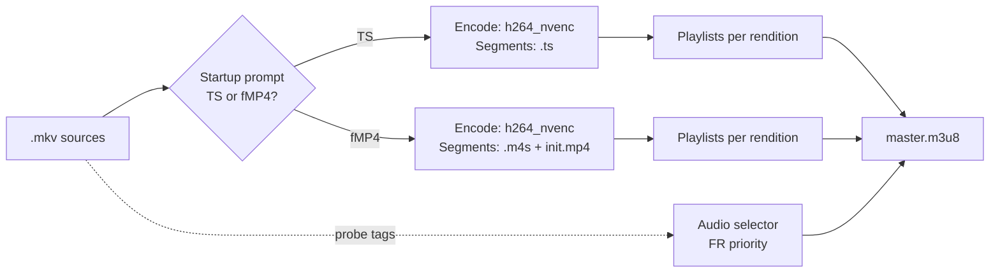

<!-- Banner / Header -->
<p align="center">
  
</p>
<h1 align="center">MKV → HLS (TS or CMAF fMP4) • NVENC • Multi‑audio • Rich TUI • i18n</h1>
<p align="center">
  Convert <b>MKV</b> to production‑ready <b>HLS VOD</b> (TS or CMAF/fMP4) with <b>NVENC</b>, multi‑renditions, multi‑audio, and a sleek <b>Rich</b> terminal UI.
</p>

<p align="center">
  <a href="https://www.python.org/"></a>
  <a href="https://ffmpeg.org/"></a>
  
  <a href="LICENSE"></a>
  
  
</p>

<p align="center">
  <a href="#-quick-start">Quick Start</a> •
  <a href="#-features">Features</a> •
  <a href="#-usage">Usage</a> •
  <a href="#-audio--i18n">Audio & i18n</a> •
  <a href="#-troubleshooting">Troubleshooting</a> •
  <a href="#-faq">FAQ</a>
</p>

---

> **Highlights**
>
> - ✅ Works on **Windows / macOS / Linux**
> - ✅ **NVENC** hardware encode (h264_nvenc)
> - ✅ **ABR** ladder: **1080p / 720p / 480p**
> - ✅ **TS** or **CMAF/fMP4** (interactive)
> - ✅ **Multi‑audio** with **French priority** (VFF > VFI > VF > VFA > VFQ)
> - ✅ **Auto‑localized** UI (fr / en / es / de)

---

## 🧭 Table of Contents

- [✨ Features](#-features)
- [📦 Requirements](#-requirements)
- [🚀 Quick Start](#-quick-start)
- [▶️ Usage](#-usage)
- [📺 Output Layout](#-output-layout)
- [🎚 Audio & i18n](#-audio--i18n)
- [⚙️ Presets](#%EF%B8%8F-presets)
- [🧩 Architecture](#-architecture)
- [🧪 Validation](#-validation)
- [🛠 Troubleshooting](#-troubleshooting)
- [❓ FAQ](#-faq)
- [📄 License](#-license)

---

## ✨ Features

| Area | What you get |
| --- | --- |
| **HLS** | VOD playlists with **10s** segments, GOP aligned for smooth seeking & ABR |
| **Renditions** | 1080p / 720p / 480p (customizable presets) |
| **Encoding** | **h264_nvenc** (keeps NVENC even if scaling falls back to CPU) |
| **Segments** | **TS** (`.ts`) or **CMAF/fMP4** (`.m4s` + `init.mp4`) |
| **Audio** | Multi‑audio detection, **French priority** (first audio is `default`) |
| **TUI** | **Rich** progress bars, per‑resolution status, live logs |
| **i18n** | FR / EN / ES / DE (auto from OS locale / env) |

> ℹ️ **Why CMAF?** CMAF/fMP4 offers lower latency, better caching, and broad support (Safari, iOS, hls.js). TS remains widely compatible and easy to debug.

---

## 📦 Requirements

- **Python 3.9+**
- **FFmpeg** with **h264_nvenc** (and ideally `scale_cuda` or `scale_npp`)  
  - Windows: use NVENC builds (e.g., **Gyan**, **BtbN**)
- **NVIDIA GPU** (for NVENC). If CUDA scaling isn’t available, scaling auto‑fallbacks to CPU.

Python dependency:

```bash
pip install rich>=13.7.0
```

---

## 🚀 Quick Start

```bash
git clone https://github.com/<your-user>/mkv-to-hls.git
cd mkv-to-hls

python -m venv .venv
# Windows
.venv\\Scripts\\activate
# macOS/Linux
source .venv/bin/activate

pip install -r requirements.txt
python main.py
```

Place your `.mkv` files next to `main.py`, or set `SCAN_DIR` in the script.

> 💡 On launch you’ll pick **TS** or **fMP4** from the interactive prompt.

---

## ▶️ Usage

```bash
python main.py
```

```
HLS mode?
  1 = TS (.ts)
  2 = fMP4 (.m4s)
Choice:
```

### ABR Ladder (defaults)

| Rendition | Resolution | Target Bitrate | Maxrate | Bufsize |
|---|---|---:|---:|---:|
| 1080p | 1920×1080 | 5500k | 7500k | 10000k |
| 720p  | 1280×720  | 3000k | 4200k | 6000k  |
| 480p  | 854×480   | 1500k | 2100k | 3000k  |

> 🎯 GOP = **10s** (e.g., 300 frames @ 30fps). Adjust in presets if needed.

---

## 📺 Output Layout

```
/Movie.Name.2024/
  master.m3u8
  1080p/
    1080p.m3u8
    000.ts | 000.m4s
    001.ts | 001.m4s
    ...
    [init.mp4 if fMP4]
  720p/
  480p/
```

* The **first audio** is marked `default` (usually **VFF** if present).  
* `master.m3u8` references the 3 renditions for **adaptive bitrate** playback.

---

## 🎚 Audio & i18n

**French audio priority** (first/default if present):

```
VFF > VFI > VF > VFA > VFQ
```

To change default language, edit in `main.py`:

```python
FRENCH_KEYS = {"fre", "fra", "fr", "french", "français", "francais", "vf", "vff", "vfi"}
# e.g. for English-first:
ENGLISH_KEYS = {"eng", "en", "english", "vo"}
```

Locale detection order:

1. CLI flag (if implemented) → 2. `LANG`/`LC_ALL` → 3. OS locale → 4. fallback to English.

---

## ⚙️ Presets

```python
PRESETS = {
  "1080p": {"w": 1920, "h": 1080, "br": "5500k", "max": "7500k", "buf": "10000k"},
  "720p":  {"w": 1280, "h": 720,  "br": "3000k", "max": "4200k", "buf": "6000k"},
  "480p":  {"w": 854,  "h": 480,  "br": "1500k", "max": "2100k", "buf": "3000k"},
}
SEG_DUR = 10  # seconds
GOP      = 10 # seconds (align with SEG_DUR)
```
> 🧰 **Tip:** keep **GOP = SEG_DUR** for clean segment boundaries and smooth seeks.

---

## 🧩 Architecture



---

## 🧪 Validation

- Test with **hls.js** (Chrome/Firefox) and **Safari/iOS**.  
- Use `ffprobe` to verify **tracks**, **default audio**, and **segment durations**.  
- Lighthouse/Pagespeed: ensure CDN caching headers for `*.m3u8` / segments.

```bash
ffprobe -hide_banner -i output/1080p/1080p.m3u8
```

---

## 🛠 Troubleshooting

<details>
<summary><b>FFmpeg says: Unknown encoder 'h264_nvenc'</b></summary>

Your FFmpeg build lacks NVENC. Install a build with NVENC (e.g., Gyan/BtbN on Windows) or compile with `--enable-nvenc`.
</details>

<details>
<summary><b>Choppy seeking or stuttering ABR</b></summary>

Ensure **GOP = 10s** and **keyint_min = GOP**. Re‑encode with aligned keyframes.
</details>

<details>
<summary><b>Scaling is slow</b></summary>

If CUDA/NPP filters aren’t available, scaling falls back to CPU. Consider enabling `scale_cuda`/`scale_npp` or reduce the ladder.
</details>

---

## ❓ FAQ

**Q: Can I output only one rendition?**  
A: Yes — comment out presets you don’t want and update the master playlist builder.

**Q: Does this support subtitles?**  
A: You can extend the command to include WebVTT sidecar tracks and reference them in `master.m3u8`.

**Q: Can I use HEVC?**  
A: The script targets H.264 for broad HLS support. You can add `hevc_nvenc`/`h265` variants if your player supports it.

---

## 📄 License

MIT License — see [LICENSE](LICENSE).

```
MIT License

Copyright (c) 2025 - Himiko aKa Keta-Klak (AnomalyaCorp)

Permission is hereby granted, free of charge, to any person obtaining a copy
of this software and associated documentation files (the "Software"), to deal
in the Software without restriction, including without limitation the rights
to use, copy, modify, merge, publish, distribute, sublicense, and/or sell
copies of the Software, and to permit persons to whom the Software is
furnished to do so, subject to the following conditions:

The above copyright notice and this permission notice shall be included in all
copies or substantial portions of the Software.

THE SOFTWARE IS PROVIDED "AS IS", WITHOUT WARRANTY OF ANY KIND, EXPRESS OR
IMPLIED, INCLUDING BUT NOT LIMITED TO THE WARRANTIES OF MERCHANTABILITY,
FITNESS FOR A PARTICULAR PURPOSE AND NONINFRINGEMENT. IN NO EVENT SHALL THE
AUTHORS OR COPYRIGHT HOLDERS BE LIABLE FOR ANY CLAIM, DAMAGES OR OTHER
LIABILITY, WHETHER IN AN ACTION OF CONTRACT, TORT OR OTHERWISE, ARISING FROM,
OUT OF OR IN CONNECTION WITH THE SOFTWARE OR THE USE OR OTHER DEALINGS IN THE
SOFTWARE.
```